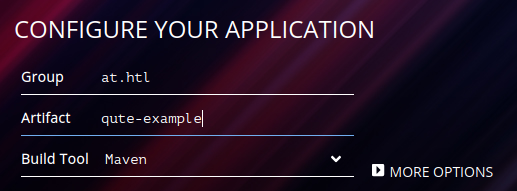
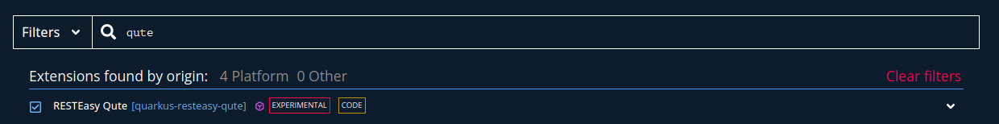
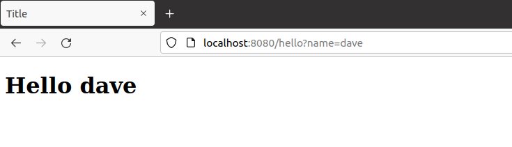
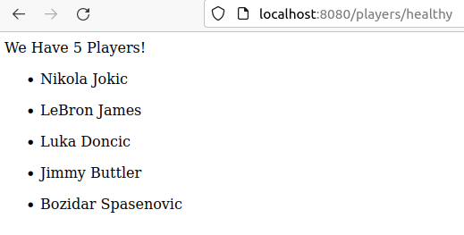
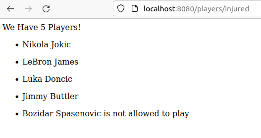

= Qute Example

== Quickstart für das Projekt

Auf Quarkus.io unter Quickstart ein neues Quarkus Projekt erstellen.

Bei der Configuration wie üblich: +
*Group:* at.htl +
*Artifact:* qute-example (Projektname) +
*Build Tool:* Maven +

Der Nächste Schritt ist wichtig den Ohne einer Qute Extension gibt es auch kein Qute.

Wichtig ist es hier die RESTEasy Qute Extension auszuwählen.

== Examples

Um ein neues Projekt zu beginnen, können wir die Klasse ``SomePage.java``, welche von Quarkus erstellt wurde, löschen.

=== Basics (Hello user)

Um die Basics zu verstehen, erstellen wir eine Klasse ``HelloResource.java``.

[source,java]
----
package at.htl;

public class HelloResource {
}
----

Um keine leere Klasse zu haben, fügen wir alles nötige ein, um einen Endpoint zu erstellen.

[source,java]
----

package at.htl;

import io.quarkus.qute.Template;
import io.quarkus.qute.TemplateInstance;

import javax.inject.Inject;
import javax.ws.rs.GET;
import javax.ws.rs.Path;
import javax.ws.rs.Produces;
import javax.ws.rs.QueryParam;
import javax.ws.rs.core.MediaType;

@Path("hello")
public class HelloResource {
    @Inject
    Template hello; // <1>

    @GET
    @Produces(MediaType.TEXT_HTML)
    public TemplateInstance get(@QueryParam("name") String name) {
        return hello.data("name", name); // <2>
    }
}

----

<1> In unserem Beispiel verwenden wir ein Template mit dem namen hello.html. Es befindet sich wie jede andere Template in ``resources/templates/``.
<2> ``hello.data()`` gibt eine neue instance der Template zurück, welche dann verwendet werden kann bevor es gerendert wird.

Die html Seite hello.html sollte ungefähr so aussehen.

[source,html]
----
<!DOCTYPE html>
<html lang="en">
<head>
    <meta charset="UTF-8">
    <title>Title</title>
</head>
<body>
    <h1> Hello {name} </h1>
</body>
</html>
----

Hello {name} gibt dann bei der Seite, Hello + den Parameter der bei der URL mitgegeben wird, aus.

Die Url sieht so aus:

``http://localhost:8080/hello?name=dave``

=== Show Player List

Um eine Liste von Spielern anzeigen zu lassen, erstellen wir eine Klasse ``Player.java``.

.Player.java
[source, java]
----
public class Player {
    public int pickNumber;
    public String name;
    public String position;
    public boolean isInjured;
    public String Team;

    public Player(int pickNumber, String name, String position, boolean isInjured, String team) {
        this.pickNumber = pickNumber;
        this.name = name;
        this.position = position;
        this.isInjured = isInjured;
        Team = team;
    }
}
----

Dazu benötigen wir eine Klasse ``PlayerResource`` und Enpoints.

[source, java]
----
@ApplicationScoped
@Path("players")
public class PlayerResource {

    @Inject
    Template players; // <1>

    @Path("/healthy")
    @GET
    @Produces(MediaType.TEXT_HTML)
    public TemplateInstance getHealthy() {
        List<Player> playerList = new LinkedList<>();

        // <2>
        playerList.add(new Player(1,"Nikola Jokic","Center",false,"Denver Nuggets"));
        playerList.add(new Player(2,"LeBron James","Small Forward",false,"LA Lakers"));
        playerList.add(new Player(3,"Luka Doncic","Shooting Guard",false,"Dallas Mavericks"));
        playerList.add(new Player(4,"Jimmy Buttler","Small Forward",false,"Chicago Bulls"));
        playerList.add(new Player(5,"Bozidar Spasenovic","Point Guard",false,"Crvena Zvezda"));

        return players.data("players",playerList); // <3>
    }

}
----

<1> Template players
<2> dummy daten
<3> liste wird übergeben an die Template players

Die Template players muss entsprechend so aussehen.

[source, html]
----
<!DOCTYPE html>
<html lang="en">
<head>
    <meta charset="UTF-8">
    <title>Title</title>
</head>
<body>
    We Have {players.size} Players!
    <ul>
        {#for player in players}
            <li>
{player.name}
</li>
        {/}
    </ul>

</body>
</html>
----

Das Resultat ist ein Einfacher Count und eine Liste von allen Spielern.

=== Show Injured Players

Um verletzte Spieler anzuzeigen, fügen wir folgenden Enpoint dazu.

Viel ändert sich hier nicht, nur ein spieler wird verletzt

[source, java]
----
 @Path("/injured")
    @GET
    @Produces(MediaType.TEXT_HTML)
    public TemplateInstance getInjured() {
        List<Player> playerList = new LinkedList<>();

        playerList.add(new Player(1,"Nikola Jokic","Center",false,"Denver Nuggets"));
        playerList.add(new Player(2,"LeBron James","Small Forward",false,"LA Lakers"));
        playerList.add(new Player(3,"Luka Doncic","Shooting Guard",false,"Dallas Mavericks"));
        playerList.add(new Player(4,"Jimmy Buttler","Small Forward",false,"Chicago Bulls"));
        playerList.add(new Player(5,"Bozidar Spasenovic","Point Guard",true,"Crvena Zvezda"));

        return players.data("players",playerList);
    }
----

Das überprüfen in einer Template funktioniert mit if und else so wie man es kennt.

[source,html]
----
<!DOCTYPE html>
<html lang="en">
<head>
    <meta charset="UTF-8">
    <title>Title</title>
</head>
<body>
    We Have {players.size} Players!
    <ul>
        {#for player in players}
            {#if player.injured is true}
                <li>
{player.name} is not allowed to play 
</li>
            {#else }
                <li>
{player.name}
</li>
            {/if}

        {/}
    </ul>

</body>
</html>
----

Das Resultat ist eine Liste mit extra Text für den Verletzten.

== Cheatsheet

=== Hello User

[source,html]
----
<html>
  
Hello {name}!
</html>
----

[source,java]
----
helloTemplate.data("name", "Jim").render();
----

=== For Loop

[source,html]
----

<html>
{item.name}
<ul>
{#for item in itemList}
  <li>
  {item.name}
  </li>
{/for}
</ul>
</html>
----

=== Arrays

[source,html]
----
<h1>Array of length: {myArray.length}</h1>
<ul>
  <li>First: {myArray.0}</li>
  <li>Second: {myArray[1]}</li>
  <li>Third: {myArray.get(2)}</li>
</ul>
<ol>
 {#for element in myArray}
 <li>{element}</li>
 {/for}
</ol>
First two elements: {#each myArray.take(2)}{it}{/each}
----

=== Sections

[source,html]
----
{#if item.name is 'Dave'}
  Hello Dave!
{#else if item.name is 'Boki'}
  Hello Boki!
{#else}
  Who are you?
{/if}
----

=== Loop Sections

[source,html]
----
{#each items}
  {it.name}
{/each}

oder

{#for item in items}
  {item.name}
{/for}
----

=== Loop with index

[source,html]
----
{#for item in items}
  {item.name}
{/for}
----

Weitere Hinweise auf https://quarkus.io/guides/qute-reference[qute-reference].
